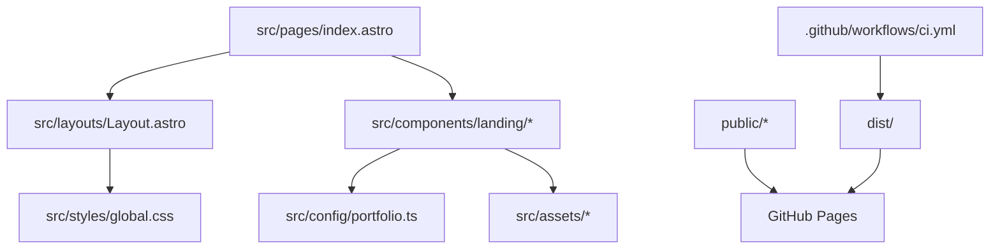

# Agent Operating Guide

## Purpose

This repository powers `justanother.engineer`, Luiz's public personal branding site. Treat it as production marketing infrastructure, not a demo. Optimize for correctness, maintainability, accessibility, fast static output, and clean public presentation.

## Architecture



## Repo Map

| Path | Responsibility |
| --- | --- |
| `src/pages/index.astro` | Single-page composition and section order |
| `src/components/landing/` | Visual sections for the public landing page |
| `src/config/portfolio.ts` | Stable export surface for portfolio content |
| `src/config/portfolio/` | Structured portfolio content split by domain |
| `src/types/portfolio.ts` | Content contracts used by config and sections |
| `src/layouts/Layout.astro` | Document shell, SEO, Open Graph, analytics, cookie banner, Calendly loader |
| `src/styles/global.css` | Tailwind import, theme tokens, global visual effects |
| `src/assets/` | Optimized image inputs imported by Astro components |
| `public/` | Static files served unchanged, including `CNAME`, favicons, robots, video, and company logos |
| `.github/workflows/ci.yml` | Build, artifact upload, and GitHub Pages deploy |
| `lefthook.yml` | Local Git hook commands |

## Stack

- Astro static output.
- Tailwind CSS v4 through `@tailwindcss/vite`.
- TypeScript strict Astro config.
- ESLint flat config with Astro support.
- Vitest for data and logic tests.
- Lefthook for local pre-commit and pre-push gates.
- GitHub Pages for hosting.

## Change Rules

- Keep README public-facing. Put agent and maintainer detail in `AGENTS.md` or `docs/`.
- Keep content centralized in `src/config/portfolio/` unless a section owns strictly local display-only data.
- Do not duplicate portfolio text inside components.
- Keep components render-focused. Move reusable structured data to config files.
- Preserve static output unless a task explicitly requires SSR.
- Use `src/assets/` for Astro-optimized images and `public/` for passthrough files.
- Do not embed secrets, tokens, private profile data, or employer-confidential details.
- Do not add migration scripts unless explicitly requested.
- Do not use absolute paths in docs or source.
- For every change, explicitly check whether docs or tests need updates.
- Update docs and tests in the same change when behavior, structure, commands, content contracts, or workflows change.

## External Documentation

Before changing external package usage, dependency versions, GitHub Actions, Astro config, Tailwind syntax, ESLint config, Vitest config, or Lefthook config:

1. Inspect current versions in `package.json` and `package-lock.json`.
2. Fetch current official docs for the exact tool.
3. Verify syntax and option names against those docs.
4. Flag deprecated, removed, or suspicious patterns.

## Quality Gates

Run targeted checks while developing, then run the full gate before completion:

```bash
npm run lint
npm run typecheck
npm run test:run
npm run build
npm run check
```

`npm run check` is the required final gate. It runs lint, typecheck, tests, and build.

## Git Hooks

Install hooks after dependency install:

```bash
npm run prepare
```

Lefthook runs lint and typecheck before commit. It runs the full check before push.

## Deployment

CI runs on pushes and pull requests targeting `main`. On `main`, it uploads `dist/` and deploys through GitHub Pages. Production uses:

- `SITE_URL=https://justanother.engineer`
- `SITE_BASE=/`
- custom domain from `public/CNAME`

## Known Debt

- Several landing components exceed 30 lines. Refactor only when touching related behavior.
- Cookie banner currently loads Google Analytics before explicit click acceptance. Review privacy behavior before public launch if strict consent is required.
- No browser-level regression tests exist. Add Playwright or similar before heavy UI interaction changes.
