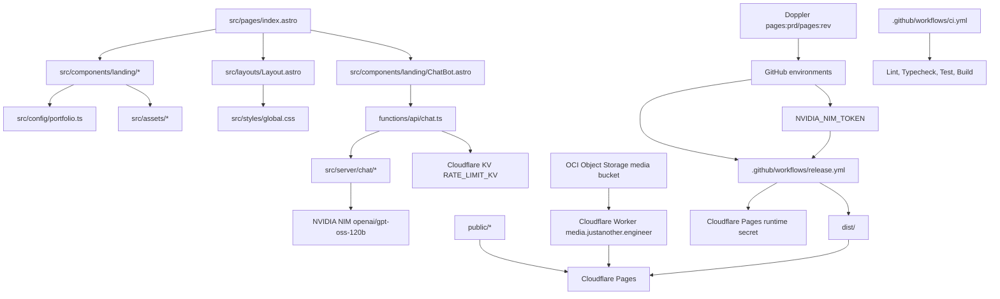

# Agent Operating Guide

## Purpose

This repository powers `justanother.engineer`, Luiz's public personal branding site. Treat it as production marketing infrastructure, not a demo. Optimize for correctness, maintainability, accessibility, fast static output, and clean public presentation.

## Architecture



## Repo Map

| Path | Responsibility |
| --- | --- |
| `src/pages/index.astro` | Single-page composition and section order |
| `src/components/landing/` | Visual sections for the public landing page |
| `src/config/portfolio.ts` | Stable export surface for portfolio content |
| `src/config/portfolio/` | Structured portfolio content split by domain, including FAQ content used by the page and chatbot |
| `src/server/chat/` | Server-only chat facts, prompt, NVIDIA NIM client, request validation, and rate limiting |
| `src/types/portfolio.ts` | Content contracts used by config and sections |
| `src/layouts/Layout.astro` | Document shell, SEO, Open Graph, analytics, cookie banner, Calendly loader |
| `src/styles/global.css` | Tailwind import, theme tokens, global visual effects |
| `functions/api/chat.ts` | Cloudflare Pages Function endpoint for the lui.z clone chatbot |
| `src/assets/` | Optimized image inputs imported by Astro components |
| `public/` | Static files served unchanged, including favicons, robots, and company logos |
| `.github/workflows/ci.yml` | Linting, typechecking, testing, and build checks |
| `.github/workflows/release.yml` | Build and Cloudflare Pages deploy |
| `lefthook.yml` | Local Git hook commands |
| `../concierge/terraform/cloudflare/` | Cloudflare Pages project, custom domain, DNS, and media Worker |
| `../concierge/terraform/oci/` | OCI Object Storage media bucket |
| `../concierge/terraform/doppler/` | Doppler project/env syncs into GitHub Actions environments |

## Stack

- Astro static output.
- Tailwind CSS v4 through `@tailwindcss/vite`.
- TypeScript strict Astro config.
- ESLint flat config with Astro support.
- Vitest for data and logic tests.
- Lefthook for local pre-commit and pre-push gates.
- Cloudflare Pages for hosting.
- Cloudflare Pages Functions for the chatbot API.
- Cloudflare KV for chatbot rate limiting.
- NVIDIA NIM `openai/gpt-oss-120b` for chatbot inference.

## Change Rules

- Keep README public-facing. Put agent and maintainer detail in `AGENTS.md` or `docs/`.
- Keep content centralized in `src/config/portfolio/` unless a section owns strictly local display-only data.
- Do not duplicate portfolio text inside components.
- Keep components render-focused. Move reusable structured data to config files.
- Preserve static output unless a task explicitly requires SSR.
- Use `src/assets/` for Astro-optimized images and `public/` for passthrough files.
- Do not embed secrets, tokens, private profile data, or employer-confidential details.
- Do not persist chatbot messages. Keep chat storage limited to short-lived hashed rate-limit identities unless an explicit privacy and retention change is requested.
- Do not add migration scripts unless explicitly requested.
- Do not use absolute paths in docs or source.
- Do not commit large public media to this repo. Use the OCI media bucket and `media.justanother.engineer`.
- Before changing deployment, preview, DNS, media URL, or CI secret behavior, inspect the related `../concierge/terraform/*` root.
- Keep `README.md`, `AGENTS.md`, this file, `public/llms.txt`, and `public/robots.txt` current when repo behavior, deployment, public content, SEO, crawler access, or agent workflow changes.
- For every change, explicitly check whether docs or tests need updates.
- Update docs and tests in the same change when behavior, structure, commands, content contracts, or workflows change.

## External Documentation

Before changing external package usage, dependency versions, GitHub Actions, Astro config, Tailwind syntax, ESLint config, Vitest config, or Lefthook config:

1. Inspect current versions in `package.json` and `package-lock.json`.
2. Fetch current official docs for the exact tool.
3. Verify syntax and option names against those docs.
4. Flag deprecated, removed, or suspicious patterns.

## Quality Gates

Run targeted checks while developing, then run the full gate before completion:

```bash
npm run lint
npm run typecheck
npm run test:run
npm run build
npm run check
```

`npm run check` is the required final gate. It runs lint, typecheck, tests, and build.

## Git Hooks

Install hooks after dependency install:

```bash
npm run prepare
```

Lefthook runs lint and typecheck before commit. It runs the full check before push.

## Deployment

Quality checks are run via `.github/workflows/ci.yml` on pushes and pull requests targeting `main`. Deployments are handled separately by `.github/workflows/release.yml` on pushes to `main` (for production) and on pull requests (for review/preview deployments), and can also be triggered manually via the GitHub Actions UI. The release workflow builds `dist/` and deploys it to the Cloudflare Pages project `jae-pages` via Wrangler. Pull requests get a Cloudflare Pages preview deployment URL posted back as a PR comment. Production uses:

- `SITE_URL=https://justanother.engineer`
- `SITE_BASE=/`
- `NVIDIA_NIM_TOKEN` synced from Doppler to GitHub environments, then written to Cloudflare Pages runtime secrets by CI
- `RATE_LIMIT_KV` Cloudflare KV binding for the chat endpoint
- Cloudflare Pages custom domain `justanother.engineer`
- Doppler project `pages`, configs `prd` and `rev`, synced into GitHub `production` and `review` environments
- `PUBLIC_POSTHOG_KEY` and `PUBLIC_POSTHOG_HOST` (public client-side variables synced via Doppler/GitHub environments)
- `PUBLIC_SENTRY_DSN` (public client-side DSN synced via Doppler/GitHub environments)
- `PUBLIC_GA_TRACKING_ID` (optional public client-side Google Analytics tracking ID synced via Doppler/GitHub environments)
- `SENTRY_AUTH_TOKEN` (private Sentry authentication token synced via Doppler/GitHub environments to upload build-time source maps)
- `PUBLIC_TURNSTILE_SITE_KEY` (public client-side Turnstile site key synced via Doppler/GitHub environments, defaults to Cloudflare's universal dummy sitekey in local dev)
- `TURNSTILE_SECRET_KEY` (private server-side Turnstile secret key synced via Doppler to GitHub environments, then written to Cloudflare Pages runtime secrets by CI)

Large media is served from OCI Object Storage through the Cloudflare Worker custom domain `media.justanother.engineer`; the default promo video URL is `https://media.justanother.engineer/lui-z-promo.mp4`.

## Known Debt

- Several landing components exceed 30 lines. Refactor only when touching related behavior.
- No browser-level regression tests exist. Add Playwright or similar before heavy UI interaction changes.
