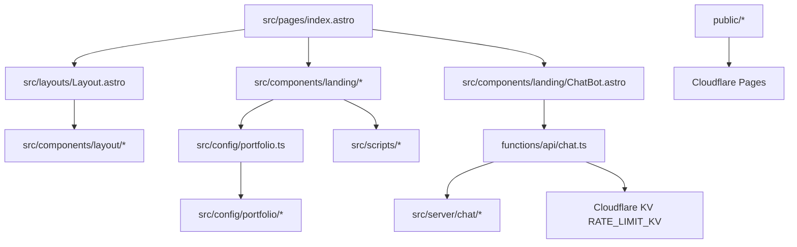

# Architecture

## Purpose

This repository builds the public `justanother.engineer` landing page and its satirical `lui.z` chatbot. Treat it as production marketing infrastructure, not a demo.

## System Shape

## Responsibility Boundaries

- `src/pages/index.astro`
  - compose the page from focused sections and shared shells
  - avoid embedding large UI blocks directly in the page
- `src/layouts/Layout.astro`
  - own metadata, document shell, and global script/bootstrap concerns
  - keep feature-specific UI in focused components
- `src/components/landing/`
  - own render logic for public landing sections
  - prefer data-driven rendering from config exports
- `src/components/layout/`
  - own layout-scoped UI that belongs to the shell rather than a landing section
- `src/config/portfolio/`
  - single source of truth for portfolio content and structured public facts
- `src/server/chat/`
  - own request parsing, facts, upstream inference calls, Turnstile, and rate limiting
- `functions/`
  - thin Cloudflare Pages entrypoints only

## Current Structural Conventions

- Tests are colocated with the code or artifact they protect.
- Static site output is required; no SSR path should be introduced without an explicit request.
- Client scripts live in `src/scripts/` and are imported from the relevant Astro component instead of large inline imperative blocks.

## When To Restructure

Restructure before documenting new patterns if any of these occur:

- `src/pages/index.astro` stops being mostly composition
- `src/layouts/Layout.astro` starts accumulating feature-specific UI
- reusable copy moves into components instead of `src/config/portfolio/`
- `functions/` starts containing business logic that belongs in `src/server/`
