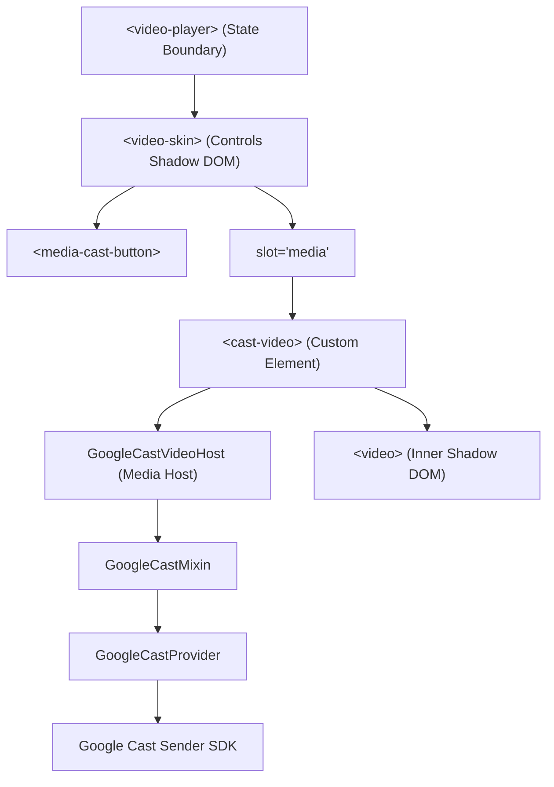

# Chromecast Support for Video.js v10 Player Design

- **Status:** Approved
- **Author:** Antigravity (AI Architect)
- **Date:** 2026-05-28

---

## 1. Background & Context

Luiz's personal landing page (`justanother.engineer`) utilizes a Video.js v10 Beta player to present the promo video (`https://media.justanother.engineer/lui-z-promo.mp4?v=2`). To offer premium capabilities, we are adding Chromecast / Google Cast support. 

Because Video.js v10 uses a modular, lightweight Web Component system (`@videojs/html`), plain `<video>` elements do not natively bridge to Google Cast without an explicit Cast-capable Media Host. 

This spec designs **Option A: Controls Bar Integration**, introducing a dynamic, Cast-capable custom media element (`<cast-video>`) that hooks seamlessly into Video.js v10's built-in `<media-cast-button>` and Glitch Yellow themed control bar.

---

## 2. Architecture & Components



### 2.1 `GoogleCastVideoHost`
A custom Media Host subclass:
- Inherits from `HTMLVideoElementHost` (from `@videojs/core`).
- Wrapped with `GoogleCastMixin` (the native Cast engine from `@videojs/core`).
- Provides the `remote` property returning a custom `RemotePlayback` controller hooked into the Google Cast framework.

### 2.2 `CastVideoElement`
A custom custom-element subclass:
- Extends the `CustomMediaElement('video', GoogleCastVideoHost)` factory to wrap a native `<video>` tag.
- Wrapped with `MediaAttachMixin` (from `@videojs/html`) to automatically register itself as the active media element in the player store.
- Registered under the custom tag name `cast-video`.

### 2.3 `<media-cast-button>`
The official button from `@videojs/html/ui/cast-button`:
- Listens to the `remotePlayback` state slices in the player provider.
- Automatically shows/hides based on device availability (`data-availability="available"`).
- Triggers the cast prompt (`toggleRemotePlayback`) when clicked.

---

## 3. Detailed Implementation Plan

### 3.1 Markup Update (`Hero.astro`)
Replace the native `<video>` tag inside the slot with our new `<cast-video>` element:

```html
<video-player id="hero-video-player">
  <video-skin>
    <cast-video 
      slot="media"
      id="hero-video"
      src={import.meta.env.PUBLIC_VIDEO_URL || "https://media.justanother.engineer/lui-z-promo.mp4?v=2"} 
      class="block w-full h-full object-cover"
      aria-label="Promotional video for lui.z"
      playsinline
      preload="metadata"
    >
      <track kind="captions" src="/media/lui-z-promo.vtt" srclang="en" label="English" default />
    </cast-video>
    ...
```

### 3.2 Dynamic Import & Element Registration
Inside `loadVideoPlayer`, dynamically import all required submodules to preserve blazing fast initial page load speeds:

```javascript
Promise.all([
  import('@videojs/html/video/player'),
  import('@videojs/html/video/skin'),
  import('@videojs/html/video/skin.css'),
  import('@videojs/html/ui/cast-button'), // Registers <media-cast-button>
  import('@videojs/core/dist/default/dom/media/custom-media-element/index.js'),
  import('@videojs/core/dist/default/dom/media/video-host.js'),
  import('@videojs/core/dist/default/dom/media/google-cast/index.js'),
  import('@videojs/html')
]).then(([
  _player,
  _skin,
  _css,
  _castButton,
  { CustomMediaElement },
  { HTMLVideoElementHost },
  { GoogleCastMixin },
  { MediaAttachMixin }
]) => {
  // Define and register <cast-video> custom element
  if (!customElements.get('cast-video')) {
    class GoogleCastVideoHost extends GoogleCastMixin(HTMLVideoElementHost) {}
    class CastVideoElement extends MediaAttachMixin(CustomMediaElement('video', GoogleCastVideoHost)) {}
    customElements.define('cast-video', CastVideoElement);
  }

  // Inject our interaction styles
  injectCustomControlsStyle();
});
```

### 3.3 Event Tracking & Play/Pause Handling
Update `initHeroTracking` to adapt to the custom element target cleanly:

```javascript
const video = document.getElementById('hero-video');
// Event listeners will be bridged natively by CustomMediaElement
if (video && !video.dataset.bound) {
  video.addEventListener('play', () => {
    if (isConsentAccepted()) {
      posthog.capture('hero_video_played');
    }
  }, { once: true });
  video.dataset.bound = 'true';
}
```

---

## 4. Visual Styles

The cast button will automatically inherit our Glitch Yellow styling using CSS variables:
```css
video-player {
  --media-color-primary: #f3eb2c;
  --media-slider-fill: #f3eb2c;
  --media-volume-fill: #f3eb2c;
}
```

By default, `<media-cast-button>` will automatically set `display: none` when Google Cast is unavailable or unsupported on the browser, avoiding any broken UI elements on Safari/Firefox or devices without Chromecast receivers.

---

## 5. Testing & Verification

1. **Typechecking:** Verify that the Astro build and TypeScript compiles cleanly:
   ```bash
   npm run check
   ```
2. **Quality Gate:** Confirm that ESLint flat config passes with no errors.
3. **Manual Validation:** Run `npm run dev` and test the player layout and controls rendering in Chrome.
