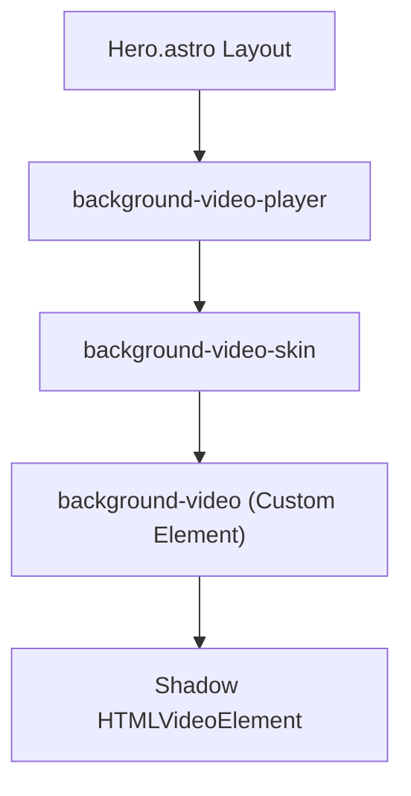

# Design Spec: Video.js v10 Beta Integration

## Executive Summary
This document specifies the integration of **Video.js v10 Beta** on the landing page of `justanother.engineer`. The goal is to replace the standard HTML5 video element in the Hero section with a modern, high-performance looping background video powered by Video.js v10's `@videojs/html` background preset.

## Goals & Scope
- **Modernize Video Infrastructure:** Utilize Video.js v10's Streaming Processor Framework (SPF) and headless core to gain an 88% reduction in player bundle size compared to legacy players.
- **Maintain Premium Brand Aesthetics:** Accentuate the background player with the site's high-contrast **Glitch Yellow** accent (`#f3eb2c`) neon shadow and borders.
- **Preserve Analytics Integrity:** Keep existing PostHog event tracking (`hero_video_played`) active by binding event listeners to the underlying media target inside the custom element's Shadow DOM.
- **Ensure Quality Control:** Keep all project code clean, fully typed, linted, and compliant with Astro 6+ and Vite build systems.

## Architectural Design

### 1. Technology & Libraries
We will install and utilize the following official pre-release packages:
- `@videojs/core@10.0.0-beta.24` (headless state management and behavior engine)
- `@videojs/html@10.0.0-beta.24` (vanilla HTML/JS Web Component preset layer)

### 2. Custom Element Pipeline
The background loop will use the dedicated background components provided by `@videojs/html/background`:
- `<background-video-player>`: The core controller wrapping the player surface.
- `<background-video-skin>`: The unstyled skin layer, which defines a simple `<media-container>` layout without any interactive control overlays.
- `<background-video>`: The custom media element which registers a reactive shadow DOM wrapper around a standard `<video>` tag, configured automatically to autoplay, loop, and mute.



## Detailed Implementation Plan

### 1. Dependency Integration
Add the following to `package.json`:
```json
"dependencies": {
  "@videojs/core": "10.0.0-beta.24",
  "@videojs/html": "10.0.0-beta.24"
}
```

### 2. Component Modification (`src/components/landing/Hero.astro`)
We will replace the native `<video>` element under the layout container with the background components.

#### Before:
```html
<video
  id="hero-video"
  class="block aspect-video w-full object-cover"
  controls
  playsinline
  preload="metadata"
  aria-label="Promotional video for lui.z"
>
  <source src={import.meta.env.PUBLIC_VIDEO_URL || "https://media.justanother.engineer/lui-z-promo.mp4?v=2"} type="video/mp4" />
  <track kind="captions" label="No dialogue" default />
  Your browser does not support the promo video.
</video>
```

#### After:
```html
<background-video-player id="hero-video-player">
  <background-video-skin>
    <background-video 
      src={import.meta.env.PUBLIC_VIDEO_URL || "https://media.justanother.engineer/lui-z-promo.mp4?v=2"} 
      class="block aspect-video w-full object-cover"
      aria-label="Promotional video for lui.z"
    >
      <track kind="captions" label="No dialogue" default />
    </background-video>
  </background-video-skin>
</background-video-player>
```

### 3. Styling & Aesthetics
To integrate the **Glitch Yellow Theme**, we will style the `<background-video-player>` in `Hero.astro`'s style block:
```css
background-video-player {
  display: block;
  border-radius: 1.75rem;
  overflow: hidden;
  border: 1px solid rgba(243, 235, 44, 0.15);
  box-shadow: 0 0 40px rgba(243, 235, 44, 0.08);
  transition: border-color 0.3s ease, box-shadow 0.3s ease;
  background: #050505;
}

background-video-player:hover {
  border-color: rgba(243, 235, 44, 0.3);
  box-shadow: 0 0 50px rgba(243, 235, 44, 0.12);
}
```

### 4. Client Script Imports & Tracking
We will update the `<script>` tag in `Hero.astro` to import the modules and configure PostHog tracking:

```typescript
import '@videojs/html/background/player';
import '@videojs/html/background/skin';
import '@videojs/html/background/video';
import '@videojs/html/background/skin.css';

// inside initHeroTracking
const bgVideo = document.querySelector('background-video');
if (bgVideo && !bgVideo.dataset.bound) {
  // Query the underlying video inside the shadow root of the background-video element
  const video = bgVideo.shadowRoot?.querySelector('video');
  if (video instanceof HTMLVideoElement) {
    video.addEventListener('play', () => {
      if (isConsentAccepted()) {
        try {
          posthog.capture('hero_video_played');
        } catch {
          // Ignore analytics capture failures silently
        }
      }
    }, { once: true });
    bgVideo.dataset.bound = 'true';
  } else {
    // If the shadow DOM hasn't fully rendered yet, observe changes or poll once safely
    const observer = new MutationObserver((_, obs) => {
      const innerVideo = bgVideo.shadowRoot?.querySelector('video');
      if (innerVideo instanceof HTMLVideoElement) {
        innerVideo.addEventListener('play', () => {
          if (isConsentAccepted()) {
            try {
              posthog.capture('hero_video_played');
            } catch {}
          }
        }, { once: true });
        bgVideo.dataset.bound = 'true';
        obs.disconnect();
      }
    });
    if (bgVideo.shadowRoot) {
      observer.observe(bgVideo.shadowRoot, { childList: true, subtree: true });
    }
  }
}
```

## Quality Gates & Verification
Before marking the task complete, we will execute the repository's strict quality check suite:
1. `npm run lint` — flat ESLint configuration verification
2. `npm run typecheck` — TypeScript type checking
3. `npm run test:run` — Vitest unit and data tests
4. `npm run build` — Astro production build compilation
5. `npm run check` — Required final gate combining lint, typecheck, tests, and build
